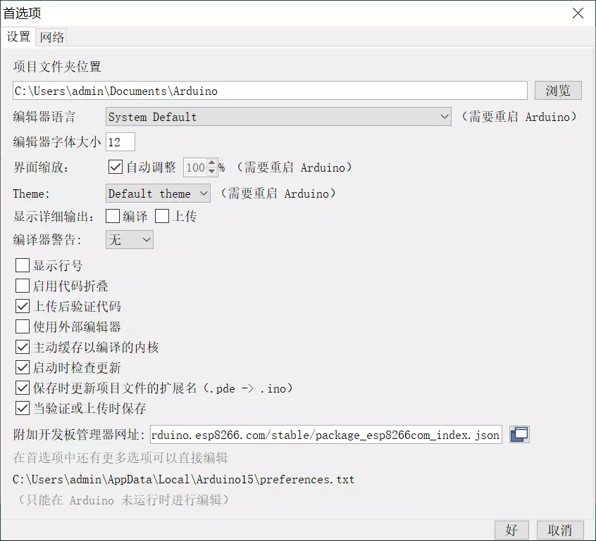
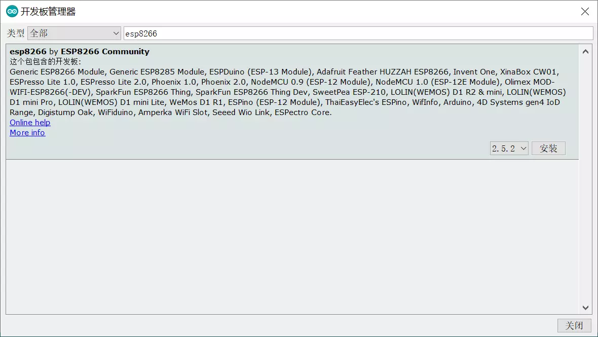
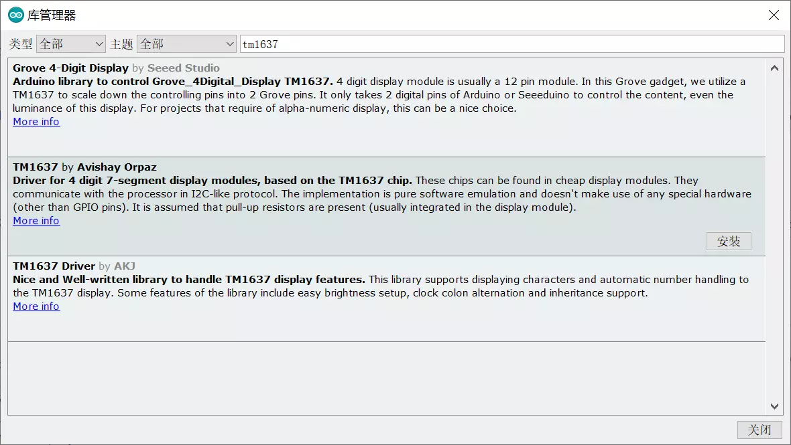
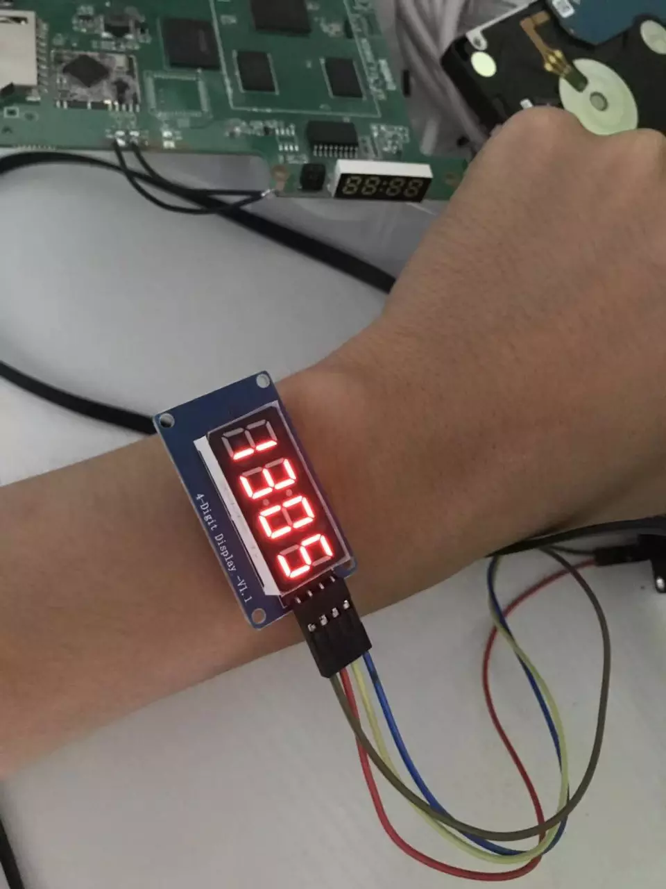
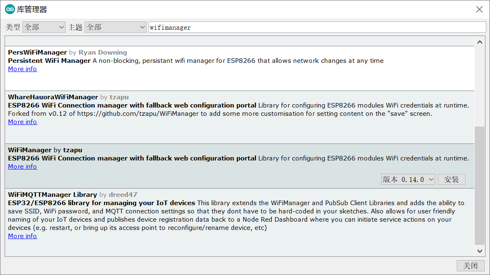
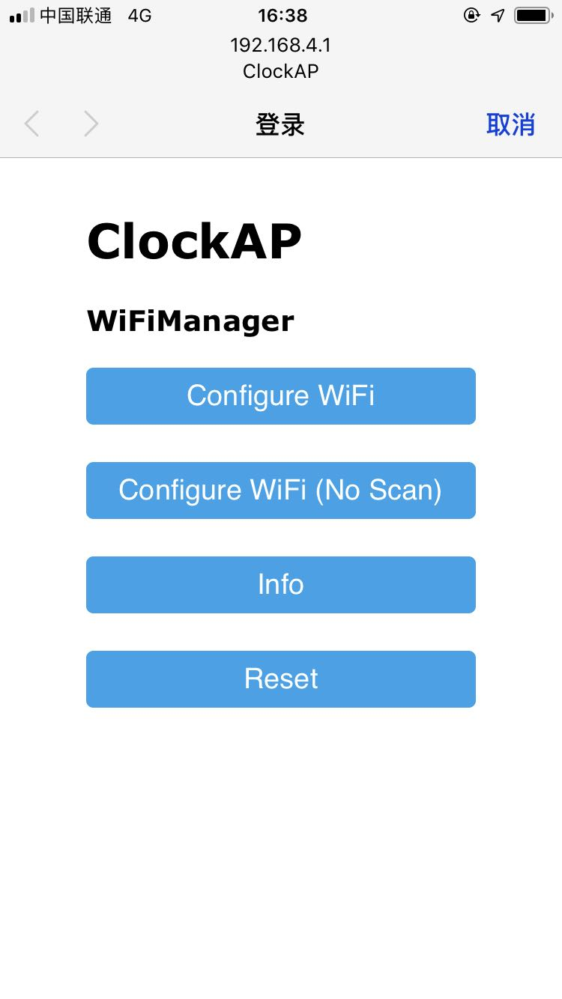
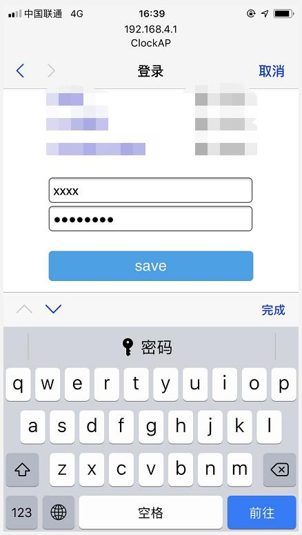
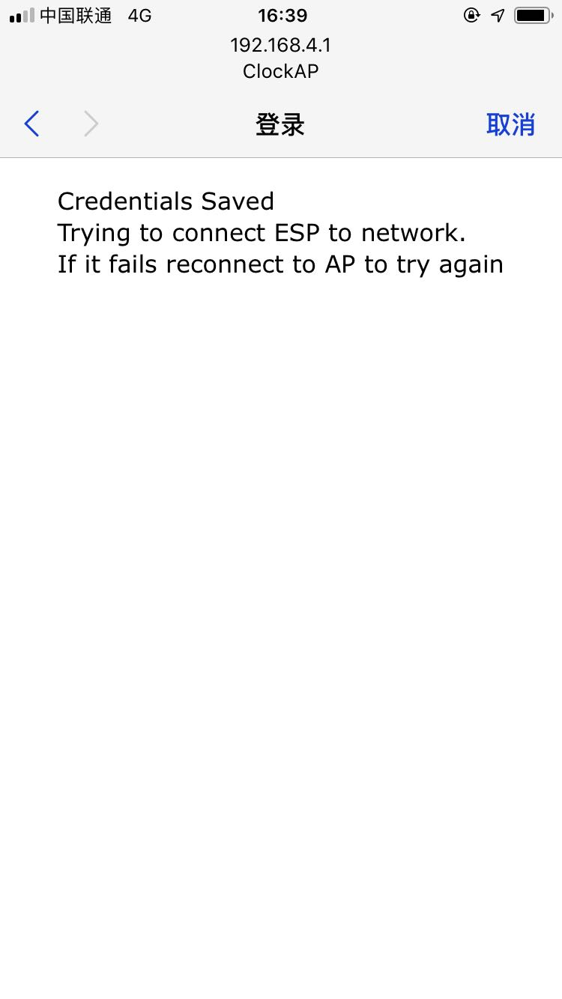

# arduino-tm1637-clock

启动后，会出现一个名为ClockAP的热点。
连接后，配置wifi。
配置成功后，ClockAP热点就不存在了。于是时钟就出现了。

在arduino的首选项里，填入以下内容，增加对esp8266的支持。
```
https://arduino.esp8266.com/stable/package_esp8266com_index.json
```



打开开发板管理器，搜索esp8266并安装。



打开库管理器，搜索tm1637，按照下图所示，点击安装。



安装完毕后，输入源码

```
#include <ESP8266WiFi.h>
#include <time.h>
#include <TM1637Display.h>

// WiFi Config
#define WIFI_SSID     "dinonetwork"
#define WIFI_PASSWORD "hellodino"

// NTP Config
int timezone = 8 * 3600;
int dst = 0;

// Module connection pins (Digital Pins)
#define CLK D5
#define DIO D7
#define TEST_DELAY   2000

const uint8_t SEG_CONN[] = {
  SEG_A | SEG_D | SEG_E | SEG_F,                   // C
  SEG_C | SEG_D | SEG_E | SEG_G,                   // o
  SEG_C | SEG_E | SEG_G,                           // n
  SEG_C | SEG_E | SEG_G                            // n
  };

const uint8_t SEG_PASS[] = {
  SEG_A | SEG_B | SEG_E | SEG_F | SEG_G,           // P
  SEG_A | SEG_B | SEG_C | SEG_E | SEG_F | SEG_G,   // A
  SEG_A | SEG_C | SEG_D | SEG_F | SEG_G,           // S
  SEG_A | SEG_C | SEG_D | SEG_F | SEG_G            // S
  };  

const uint8_t SEG_FAIL[] = {
  SEG_A | SEG_E | SEG_F | SEG_G,                   // F
  SEG_A | SEG_B | SEG_C | SEG_E | SEG_F | SEG_G,   // A
  SEG_F | SEG_G,                                   // I
  SEG_D | SEG_F | SEG_G                            // L
  };    

const uint8_t SEG_DONE[] = {
  SEG_B | SEG_C | SEG_D | SEG_E | SEG_G,           // d
  SEG_A | SEG_B | SEG_C | SEG_D | SEG_E | SEG_F,   // O
  SEG_C | SEG_E | SEG_G,                           // n
  SEG_A | SEG_D | SEG_E | SEG_F | SEG_G            // E
  };  

TM1637Display display(CLK, DIO);

String lastTimeStr;
unsigned long lastShowColon = 0;
bool showColon = false;
bool hourcheck=false;
  
void setup()
{
  display.setBrightness(0x01);// 0x01~0x0e
  
  // Connect WiFi
  WiFi.mode(WIFI_STA);
  WiFi.begin(WIFI_SSID, WIFI_PASSWORD);
  display.setSegments(SEG_CONN);

  while (WiFi.status() != WL_CONNECTED) 
  {
    delay(500);
  }
  display.setSegments(SEG_PASS);
  delay(1000);

  // Get time from NTP server
  configTime(timezone, dst, "ntp.ku.ac.th", "fw.eng.ku.ac.th", "ilm.live.rmutt.ac.th");
  while (!time(nullptr)) 
  {
    delay(500);
  }
  display.setSegments(SEG_DONE);
    delay(1000);
}

void loop()
{
  while (WiFi.status() != WL_CONNECTED) 
  {
    connect_wifi();
  }
  uint8_t hour;
  bool hourcheck;
  time_t now = time(nullptr);
  struct tm* p_tm = localtime(&now);
  
  hour=p_tm->tm_hour;

  if(hour<1)
  {
    hourcheck=true;
  }
  else
  {
    hourcheck=false;
  }
  if((p_tm->tm_sec % 2) == 0)
  {
    display.showNumberDecEx(hour*100+p_tm->tm_min,0x40 ,hourcheck);
  }
  else
  {
    display.showNumberDecEx(hour*100+p_tm->tm_min,0x00, hourcheck );
  }
  
}
void connect_wifi()
{
   WiFi.mode(WIFI_STA);
  WiFi.begin(WIFI_SSID, WIFI_PASSWORD);
  display.setSegments(SEG_CONN);
}
```

烧录后，已经可以正常使用了。



但是现在的wifi是固定的。我们要做成可配置的。安装一个wifimanager。




现在代码如下：

```
#include <ESP8266WiFi.h>
#include <time.h>
#include <TM1637Display.h>
//needed for library
#include <DNSServer.h>
#include <ESP8266WebServer.h>
#include <WiFiManager.h>         //https://github.com/tzapu/WiFiManager


// NTP Config
int timezone = 8 * 3600;
int dst = 0;

// Module connection pins (Digital Pins)
#define CLK D5
#define DIO D7
#define TEST_DELAY   2000

const uint8_t SEG_CONN[] = {
  SEG_A | SEG_D | SEG_E | SEG_F,                   // C
  SEG_C | SEG_D | SEG_E | SEG_G,                   // o
  SEG_C | SEG_E | SEG_G,                           // n
  SEG_C | SEG_E | SEG_G                            // n
  };

const uint8_t SEG_PASS[] = {
  SEG_A | SEG_B | SEG_E | SEG_F | SEG_G,           // P
  SEG_A | SEG_B | SEG_C | SEG_E | SEG_F | SEG_G,   // A
  SEG_A | SEG_C | SEG_D | SEG_F | SEG_G,           // S
  SEG_A | SEG_C | SEG_D | SEG_F | SEG_G            // S
  };  

const uint8_t SEG_FAIL[] = {
  SEG_A | SEG_E | SEG_F | SEG_G,                   // F
  SEG_A | SEG_B | SEG_C | SEG_E | SEG_F | SEG_G,   // A
  SEG_F | SEG_G,                                   // I
  SEG_D | SEG_F | SEG_G                            // L
  };    

const uint8_t SEG_DONE[] = {
  SEG_B | SEG_C | SEG_D | SEG_E | SEG_G,           // d
  SEG_A | SEG_B | SEG_C | SEG_D | SEG_E | SEG_F,   // O
  SEG_C | SEG_E | SEG_G,                           // n
  SEG_A | SEG_D | SEG_E | SEG_F | SEG_G            // E
  };  

TM1637Display display(CLK, DIO);

String lastTimeStr;
unsigned long lastShowColon = 0;
bool showColon = false;
bool hourcheck=false;
  
void setup()
{
  display.setBrightness(0x01);// 0x01~0x0e
  WiFiManager wifiManager;
  wifiManager.autoConnect("ClockAP");
  
  display.setSegments(SEG_CONN);
  while (WiFi.status() != WL_CONNECTED) 
  {
    delay(500);
  }
  display.setSegments(SEG_PASS);
  delay(1000);

  // Get time from NTP server
  configTime(timezone, dst, "ntp.ku.ac.th", "fw.eng.ku.ac.th", "ilm.live.rmutt.ac.th");
  while (!time(nullptr)) 
  {
    delay(500);
  }
  display.setSegments(SEG_DONE);
  delay(1000);
}

void loop()
{
  uint8_t hour;
  bool hourcheck;
  time_t now = time(nullptr);
  struct tm* p_tm = localtime(&now);
  
  hour=p_tm->tm_hour;

  if(hour<1)
  {
    hourcheck=true;
  }
  else
  {
    hourcheck=false;
  }
  if((p_tm->tm_sec % 2) == 0)
  {
    display.showNumberDecEx(hour*100+p_tm->tm_min,0x40 ,hourcheck);
  }
  else
  {
    display.showNumberDecEx(hour*100+p_tm->tm_min,0x00, hourcheck );
  }
}
```

这样，手机搜索名为ClockAP的项目，连接后，配置wifi即可。



输入你的wifi和密码


出现这个界面，说明配置好了。这个时候数码时钟就可以工作了。

